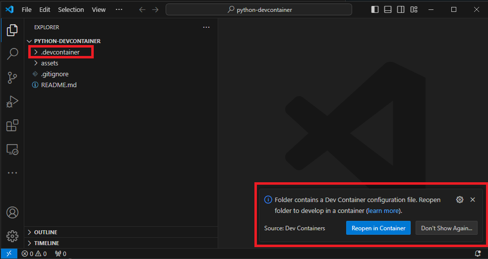
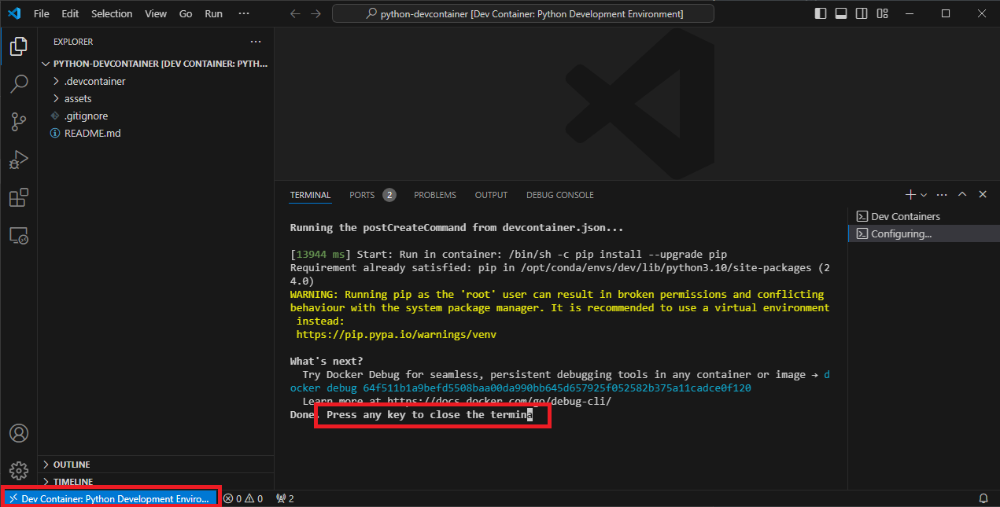
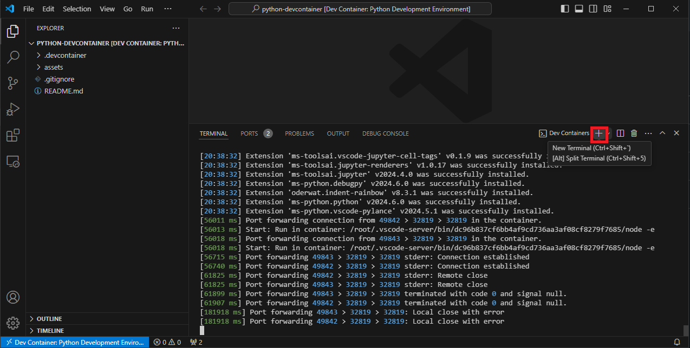
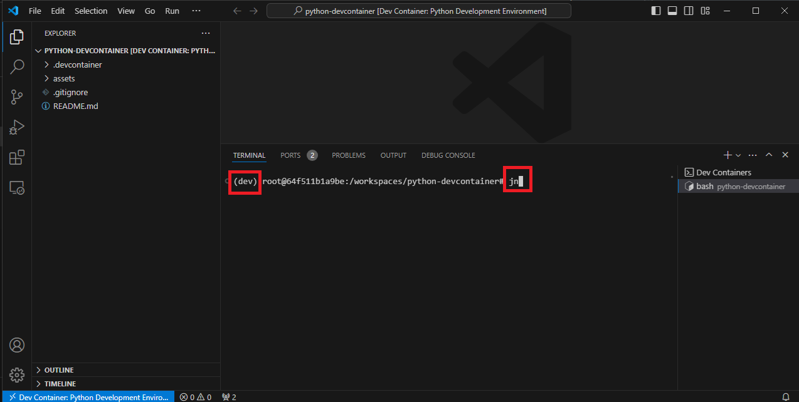
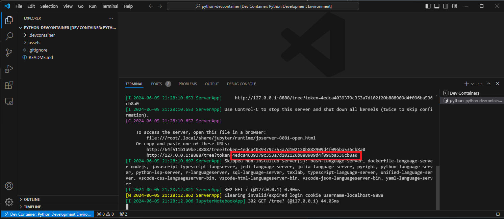
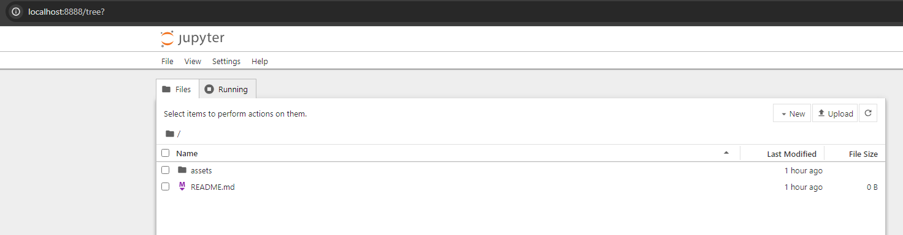
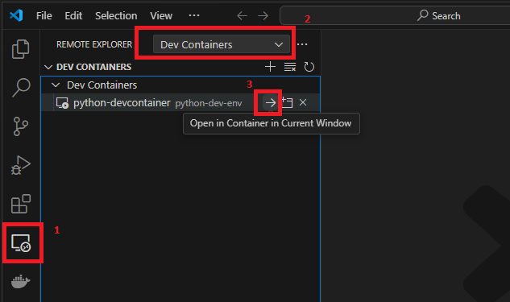

# Python Development Environment Dev Container

This repo contains a [devcontainer](https://containers.dev/)-based development environment for Python via VS Code and Docker.

## Prerequisites/Dependencies

Install the following on your system before proceeding:
* [VS Code](https://code.visualstudio.com/)
* [Remote Development](https://marketplace.visualstudio.com/items?itemName=ms-vscode-remote.vscode-remote-extensionpack) extension pack for VS Code
* [Docker]() extension for VS Code
* [Docker Desktop](https://docs.docker.com/) (or equivalent Docker Engine)

> [!IMPORTANT]  
> If either VS Code and/or Docker is already present on your system, be sure to update either/both to the most recent version before proceeding. Otherwise, if installing from scratch/initially, on successful installation, it is advisable to reboot your system before proceeding. Default options are recommended for installations (in particular, use WSL rather than Hyper-V for Docker Desktop installation on Windows; this should be the default setting in the installer already).

## Launching the Development Environment

First, locate an intended working directory on your system, and clone this repository into it, i.e.,:

```bash
git clone https://github.com/awpala/python-devcontainer.git
```

> [!NOTE]  
> Alternatively, you can download the source files from GitHub via green `<> Code` button followed by `Download ZIP` and then extract the contents into this local host system directory instead.

Next, open this repo as a VS Code project, which should appear as follows:

<center>

</center>

VS Code should automatically detect the subfolder `.devcontainer` in the opened project and consequently generate a modal in the bottom-right corner. Click `Reopen in Container` to create the devcontainer.

> [!NOTE]  
> If the modal disappears, you can accomplish the equivalent via `Ctrl Shift P` (or equivalently `Cmd Shift P` on macOS) to open the Command Palette, followed by search of `Dev Containers: Reopen in Container` (select this option accordingly).

VS Code will reopen in the devcontainer and commence installation of dependencies (this may take a few minutes on initial launch). On successful launch, it will appear as follows:

<center>

</center>

Note the container connection status in the bottom-left corner (annotated in the figure above). Furthermore, you can press `Enter` to clear the setup terminal, as annotated in the figure above.

At this point, the development environment is ready. The default conda user profile `dev` is loaded in the VS Code terminal, and relevant Python VS Code extensions are also loaded in the devcontainer (e.g., syntax highlighting on creation of a new `.py` source file). Additionally, note that file changes are propagated in realtime between the devcontainer and the host system (at the original location where the devcontainer was created, i.e., `<host-path>/python-devcontainer`).

## Running Jupyter Notebook

To run the Jupyter Notebook application in the browser, simply open a new terminal (which should have conda enviroment `dev` preset on launch) and run the command as follows:

```bash
jn
```

(corresponding screenshots)


<center>

</center>

<center>

</center>

The default browser will automatically open with the Jupyter Notebook app running on port `8888` (forwarded from the devcontainer to the host system). To proceed, copy the token from the running terminal as follows (alternatively, click on the link having general form `http://127.0.0.1:8888/tree?token=<TOKEN>` in the terminal to relaunch in the browser with the token comprised of alphanumeric value `<TOKEN>`):

<center>

</center>

<center>

</center>

<center>

</center>

The top-level directory `/` in Jupyter Notebook corresponds to the top-level directory in the VS Code devcontainer (i.e., filesystem location `/home/dev-files`); furthermore, these file changes are propagated in real time to the host system as well, as described previously.

## Relaunching the Devcontainer

The devcontainer will run indefinitely, provided that the Docker Engine is running (i.e., via running Docker Desktop app) and that the container is not destroyed.

If VS Code has been closed, the running devcontainer can be relaunched via the Remote Explorer as follows:

<center>

</center>

## Changing Default Profile

The current default profile defines conda env `dev` having Python v. `3.10`. To adjust these settings, simply make corresponding changes to file `.devcontainer/Dockerfile` (see `ARG`s entries near the top/start of the file).

## Additional References

VS Code
* [VS Code Remote Development](https://code.visualstudio.com/docs/remote/remote-overview)
* [VS Code Dev Containers](https://code.visualstudio.com/docs/devcontainers/containers)
* [Python in Docker-based VS Code](https://code.visualstudio.com/docs/containers/quickstart-python)
* [Jupyter Notebooks in VS Code](https://code.visualstudio.com/docs/datascience/jupyter-notebooks)

Docker
* [Docker Docs](https://docs.docker.com/)
* [Docker Hub](https://hub.docker.com/) (images registry)
* [`miniconda3`](https://hub.docker.com/r/continuumio/miniconda3) (base image)
